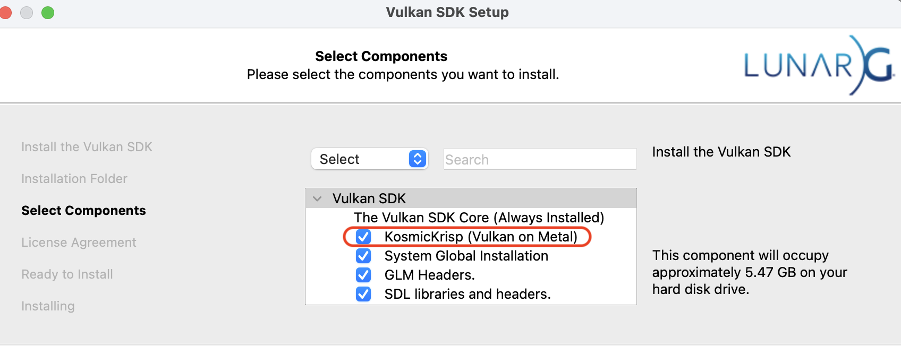
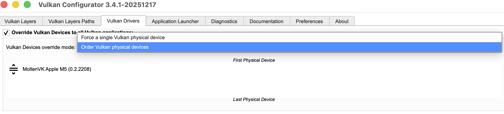

# Enabling Vulkan on macOS with KosmicKrisp

> **Note**
> KosmicKrisp is implemented on top of Metal 4, which requires **macOS 26 or newer**.
> These instructions were last validated with Vulkan SDK version **1.4.335.1**.

This document explains how to enable and verify Vulkan support on macOS using 
**KosmicKrisp**, alongside MoltenVK, and how to configure the system so both 
drivers are visible to Vulkan tooling.

## 1. Install the Vulkan SDK

Download and install the Vulkan SDK from LunarG:

[https://vulkan.lunarg.com](https://vulkan.lunarg.com)

During installation, ensure that **KosmicKrisp** is selected as one of the components.


By default, the SDK is installed to:
```
/Users/<username>/VulkanSDK/<sdk_version>/
```

After installation, run:
```bash
vulkaninfo --summary
```

At this point, you will typically see **only one Vulkan physical device**, backed by **MoltenVK**.
Example output:
```
Devices:
========
GPU0:
        apiVersion         = 1.4.323
        driverVersion      = 0.2.2208
        vendorID           = 0x106b
        deviceID           = 0x1a020209
        deviceType         = PHYSICAL_DEVICE_TYPE_INTEGRATED_GPU
        deviceName         = Apple M5
        driverID           = DRIVER_ID_MOLTENVK
        driverName         = MoltenVK
        driverInfo         = 1.4.0
        conformanceVersion = 1.4.2.0
```

If you scroll to the top of the `vulkaninfo` output, you may also see an error similar to the following:
```
ERROR: [Loader Message] Code 0 : dlopen(/usr/local/share/vulkan/icd.d/../../../lib/libvulkan_kosmickrisp.dylib, 0x0005): tried:
  '/usr/local/lib/libvulkan_kosmickrisp.dylib' (no such file)
ERROR: [Loader Message] Code 0 : loader_icd_scan: Failed loading library associated with ICD JSON
```

## 2. Fix the KosmicKrisp ICD Library Path
This error occurs because the ICD file:

```
/usr/local/share/vulkan/icd.d/libkosmickrisp_icd.json
```
references the library path:

```json
"../../../lib/libvulkan_kosmickrisp.dylib"
```

However, the actual KosmicKrisp dylib is installed inside the Vulkan SDK directory:

```
/Users/<username>/VulkanSDK/<sdk_version>/macOS/lib/libvulkan_kosmickrisp.dylib
```

### Option A: Create a Symlink

Create a symlink so the loader can find the library at the expected location:

```bash
sudo ln -s \
  /Users/<username>/VulkanSDK/<sdk_version>/macOS/lib/libvulkan_kosmickrisp.dylib \
  /usr/local/lib/libvulkan_kosmickrisp.dylib
```

### Option B: Edit the ICD JSON

Alternatively, you can edit `libkosmickrisp_icd.json` directly and update the `library_path` 
field to point to the SDK location. 


## 3. Configure vkconfig to Expose Multiple Devices

After fixing the library path, running `vulkaninfo --summary` will **still show only one GPU** by default. This is due to Vulkan loader configuration.

Launch the Vulkan Configurator GUI:

```bash
vkconfig-gui
```

In **Global Settings**, change:

* **From:** `Force a single Vulkan physical device`
* **To:** `Order Vulkan physical devices`



Apply the changes and close the tool.


## 4. Verify KosmicKrisp Is Visible

Run `vulkaninfo --summary` again. You should now see **two Vulkan devices**:

```
Devices:
========
GPU0:
        driverName         = MoltenVK
        driverID           = DRIVER_ID_MOLTENVK
...<SAME AS BEFORE>...
GPU1:
        apiVersion         = 1.3.335
        driverVersion      = 25.99.99
        vendorID           = 0x106b
        deviceID           = 0x0064
        deviceType         = PHYSICAL_DEVICE_TYPE_INTEGRATED_GPU
        deviceName         = Apple M5
        driverID           = DRIVER_ID_MESA_KOSMICKRISP
        driverName         = KosmicKrisp
        driverInfo         = sdk-1.4.335
        conformanceVersion = 1.4.3.2
```

At this point, KosmicKrisp is correctly installed and exposed to the Vulkan loader.


## 5. Running the Offload Test Suite with KosmicKrisp

To run the LLVM offload test suite against KosmicKrisp, set the target GPU name explicitly:

```bash
OFFLOADTEST_GPU_NAME=KosmicKrisp ninja -C <offload_build_dir> check-hlsl-clang-vk
OFFLOADTEST_GPU_NAME=KosmicKrisp ninja -C <offload_build_dir> check-hlsl-vk
```

This forces the test harness to select the KosmicKrisp Vulkan device instead of MoltenVK.


## Summary

* Install the Vulkan SDK with KosmicKrisp enabled
* Fix the ICD library path (symlink or icd file change)
* Update vkconfig to allow multiple physical devices
* Verify KosmicKrisp appears in `vulkaninfo`
* Run Vulkan offload tests targeting KosmicKrisp explicitly

Following these steps ensures a reliable Vulkan-on-macOS setup using KosmicKrisp.
